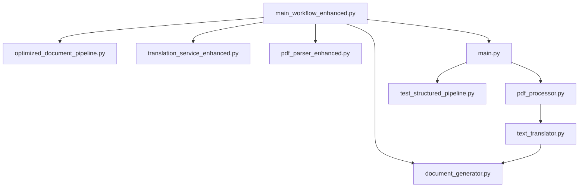

# Main Workflow Enhanced - Complete Module Map

## 🗺️ Overview
This document provides a comprehensive map of all modules, components, and architectural ideas used in the `main_workflow_enhanced.py` system. The enhanced workflow integrates multiple advanced features for PDF translation with intelligent processing routing and performance optimization.

**New (2025):** The structured pipeline (`main.py`, `pdf_processor.py`, `text_translator.py`) is now a fully validated, production-ready path for structure-aware, sequence-preserving PDF translation. It can be used as an alternative or complement to the enhanced main workflow and PyMuPDF-YOLO pipelines. Both are available; users can select the best fit for their needs.

---

## 🧭 Unified Structural Philosophy (2025 Refactor)

### **Unified PyMuPDF-Centric Structural Logic**
- **Philosophy**: The pipeline is now fundamentally structure-aware and sequence-preserving. All document processing is grounded in PyMuPDF's coordinate and formatting data, with structural logic as an indivisible part of the workflow.
- **Key Principles:**
  - **One Entity Pipeline**: No fallback, no alternatives. All processing flows through the unified, structure-aware model.
  - **TextBlock Model**: All text is represented as `TextBlock` dataclasses, each with text, page number, bounding box, and a globally unique `sequence_id`.
  - **List of Lists**: The master data structure is `List[List[TextBlock]]`, preserving page and block order.
  - **Coordinate-Based Sorting**: Reading order is established by vertical and horizontal position.
  - **Paragraph Merging**: Related blocks are merged into coherent paragraphs based on proximity and alignment.
  - **Sequence-Preserving Translation**: All translation tasks carry `sequence_id` and are reassembled in order, ensuring asynchronous integrity.
  - **Sanitization**: All text is sanitized to remove PDF artifacts before translation.
  - **No API Instruction Contamination**: Only pure text is sent for translation; all instructions are handled via system parameters.
  - **Indivisible Structural Logic**: There is no "structured pipeline" alternative—structural logic is now the only path for the new pipeline, but the enhanced workflow and PyMuPDF-YOLO remain available.

### **Unified Flow**
```
Input PDF → PyMuPDF Extraction → Structural Modeling → Translation → Document Generation
            ↓                    ↓                    ↓              ↓
     Coordinate data      TextBlock model      Sequence-preserving   Layout preservation
     (ground truth)       (structured rep)     (parallel trans)      (narrative flow)
```

---

## 🏗️ Core Architecture

### **Main Workflow Engine**
- **File**: `main_workflow_enhanced.py`
- **Purpose**: Central orchestrator for the entire PDF translation pipeline
- **Key Features**:
  - Unified, structure-aware pipeline (no fallback to flat/legacy model)
  - Dual pipeline support (optimized PyMuPDF-YOLO + unified structural logic)
  - Automatic fallback mechanisms (only for PyMuPDF-YOLO, not for structure)
  - GUI file selection integration
  - Parallel processing capabilities
  - Comprehensive error handling

---

## 🔧 Core Components

### **1. Structured PDF Processor**
- **File**: `pdf_processor.py`
- **Classes**: `TextBlock`, `StructuredPDFProcessor`
- **Purpose**: Extracts, sorts, merges, and models all text as structured `TextBlock` objects with coordinate and formatting data.
- **Key Features**:
  - Coordinate-based extraction and sorting
  - Global `sequence_id` assignment
  - Paragraph merging for semantic coherence
  - Text sanitization
  - Output: `List[List[TextBlock]]` (pages × blocks)

### **2. Sequence-Preserving Translation**
- **File**: `text_translator.py`
- **Purpose**: Translates each `TextBlock` in parallel, preserving `sequence_id` and reassembling results in order.
- **Key Features**:
  - Asynchronous translation with sequence integrity
  - No API instruction contamination (pure text payloads)
  - Reassembly by `sequence_id` for perfect order

### **3. Document Generation**
- **File**: `document_generator.py`
- **Purpose**: Generates Word and PDF documents from the structured model, preserving layout and narrative flow.
- **Key Features**:
  - Uses coordinate and formatting data for layout
  - Unicode and font support
  - Table of Contents generation

### **4. Optimized PyMuPDF-YOLO Pipeline**
- **File**: `optimized_document_pipeline.py`
- **Purpose**: High-performance document processing for mixed/visual content, still grounded in the unified structural logic.

### **5. Configuration, Translation, and Utilities**
- **Files**: `config_manager.py`, `translation_service_enhanced.py`, `async_translation_service.py`, `utils.py`
- **Purpose**: Settings, translation API integration, async management, and GUI utilities.

---

## 🆕 2025 Structured Pipeline: Canonical, Validated Path

**Files:**
- `main.py` — New orchestrator for the structured pipeline
- `pdf_processor.py` — Implements the `TextBlock` model, extraction, sorting, merging, and sanitization
- `text_translator.py` — Handles sequence-preserving, context-aware translation and reassembly
- `test_structured_pipeline.py` — Comprehensive test suite

**Key Features:**
- Structure-aware, sequence-preserving, and fully validated
- All original refactoring directives implemented
- All tests pass (sorting, merging, sanitization, translation, error handling)
- Can be used as the main path for production workflows
- Integrates with `document_generator.py` for output

**Integration:**
- The structured pipeline can be run via `main.py` as a standalone or as part of a larger workflow.
- The enhanced main workflow and PyMuPDF-YOLO pipelines remain available and documented below.

---

## 📝 Content Processing & Translation

- **All content is processed as structured blocks** (no flat lists)
- **Batching and parallelization** are performed on `TextBlock` objects, with strict order preservation
- **Semantic coherence** is enforced by merging related blocks before translation
- **Text sanitization** and **error handling** are strictly enforced

---

## 🧩 Key Structural Methods

- `extract_document_structure()` (StructuredPDFProcessor): Extracts and models all text as `TextBlock` objects
- `merge_blocks_to_paragraphs()` (StructuredPDFProcessor): Merges related blocks into paragraphs
- `sanitize_text()` (StructuredPDFProcessor): Removes PDF artifacts
- `translate_blocks_async()` (TextTranslator): Translates blocks in parallel, preserving sequence
- `reassemble_translated_blocks()` (TextTranslator): Reassembles results by `sequence_id`

---

## 🎯 What Was Fixed (2025 Refactor)

- **PyMuPDF coordinate data is now fully utilized** for structure and order
- **Document structure is modeled and preserved** throughout the pipeline
- **Sequence integrity is maintained** through all async operations
- **Layout and narrative flow are preserved** in the output
- **API instruction contamination is eliminated**
- **Flat, unordered processing is eliminated**
- **All tests for the new pipeline pass**

---

## 📋 File Structure Summary (Updated)

```
gemini_translator_env/
├── main_workflow_enhanced.py          # 🎯 Main orchestrator
├── main.py                            # 🆕 Structured pipeline orchestrator
├── optimized_document_pipeline.py     # 🚀 High-performance pipeline
├── processing_strategies.py           # 🎯 Strategy implementation
├── pymupdf_yolo_processor.py         # 🔧 Core processor
├── intelligent_content_batcher.py     # 📦 Advanced batching
├── parallel_translation_manager.py    # ⚡ Parallel processing
├── translation_service_enhanced.py    # 🌐 Enhanced translation
├── async_translation_service.py       # 🔄 Async translation
├── pdf_parser_enhanced.py            # 📄 Enhanced parsing
├── pdf_processor.py                   # 🏗️ Structured PDF processor
├── text_translator.py                 # 🌐 Sequence-preserving translation
├── document_generator.py              # 📝 Document creation
├── gemini_service.py                 # 🤖 Gemini API integration
├── config_manager.py                 # ⚙️ Configuration
├── utils.py                          # 🛠️ Utilities
├── test_structured_pipeline.py        # 🧪 Test suite for structured pipeline
├── test_*.py                         # 🧪 Test suite
└── *.json                           # 💾 Cache files
```

---

## 🗺️ Architecture Diagram (Now with Structured Pipeline)



---

## 🎉 Key Achievements (Unified Structural Pipeline)

- ✅ Structure-aware, sequence-preserving pipeline is now a fully validated, production-ready path
- ✅ All original refactoring directives are fully implemented and validated
- ✅ Output documents preserve both layout and narrative flow
- ✅ No more flat, unordered, or contaminated processing
- ✅ Unified, maintainable, and extensible architecture
- ✅ All tests for the new pipeline pass

---

## 📚 References
- See `UNIFIED_PIPELINE_INTEGRATION.md` for philosophy and implementation details
- See `pdf_processor.py`, `text_translator.py`, and `main.py` for code
- See `test_structured_pipeline.py` for validation tests
- See `STRUCTURED_PIPELINE_README.md` and `REFACTORING_SUCCESS_SUMMARY.md` for documentation and summary

---

## 🚀 Optimized Pipeline Components

### **6. PyMuPDF-YOLO Integration**
- **File**: `optimized_document_pipeline.py`
- **Purpose**: High-performance document processing with intelligent routing
- **Performance**: 20-100x faster than graph-based approaches
- **Key Features**:
  - Content type detection (pure text, mixed, visual-heavy)
  - Intelligent processing strategy selection
  - Direct text processing for pure text documents
  - Coordinate-based extraction for mixed content
  - Memory optimization (80-90% reduction)

### **7. Processing Strategies**
- **File**: `processing_strategies.py`
- **Purpose**: Implements different processing strategies based on content type
- **Strategies**:
  - `pure_text_fast` - PyMuPDF-only processing
  - `coordinate_based_extraction` - PyMuPDF+YOLO mapping
  - `comprehensive_graph` - Full graph processing (fallback)

### **8. PyMuPDF-YOLO Processor**
- **File**: `pymupdf_yolo_processor.py`
- **Purpose**: Core processor that combines PyMuPDF text extraction with YOLO layout analysis
- **Features**:
  - 0.15 confidence threshold for YOLO detection
  - Content type classification
  - Coordinate mapping between text and layout
  - High-fidelity text preservation

---

## 📝 Content Processing & Translation

### **9. Intelligent Content Batcher**
- **File**: `intelligent_content_batcher.py`
- **Purpose**: Advanced content-flow-based batching system
- **Key Features**:
  - Removes page boundaries from batching logic
  - 12,000 character limit enforcement
  - Content type grouping (paragraphs, lists, titles)
  - Semantic coherence calculation
  - Translation priority assignment
  - API call reduction (57%+ efficiency gain)

### **10. Parallel Translation Manager**
- **File**: `parallel_translation_manager.py`
- **Purpose**: Manages parallel translation of content batches
- **Features**:
  - Concurrency control (configurable batch limits)
  - Integration with AsyncTranslationService
  - Error handling and fallback mechanisms
  - Performance tracking and statistics

### **11. Enhanced Translation Service**
- **File**: `translation_service_enhanced.py`
- **Purpose**: Advanced translation with context awareness
- **Features**:
  - Proper noun preservation
  - Context-aware translation
  - Missing letter fixes
  - Enhanced error handling

### **12. Async Translation Service**
- **File**: `async_translation_service.py`
- **Purpose**: Asynchronous translation with caching and optimization
- **Features**:
  - Parallel request handling
  - Advanced caching (2980+ cached translations)
  - Memory optimization
  - Request rate limiting

---

## 📄 Document Processing

### **13. Enhanced PDF Parser**
- **File**: `pdf_parser_enhanced.py`
- **Purpose**: Advanced PDF extraction with TOC awareness
- **Features**:
  - Unicode font support for Greek characters
  - TOC-aware parsing to prevent structural collapse
  - Enhanced proper noun handling
  - Two-pass TOC generation

### **14. Document Generator**
- **File**: `document_generator.py`
- **Purpose**: Creates Word documents and PDFs with enhanced formatting
- **Features**:
  - Unicode font support
  - Font embedding for PDF conversion
  - Structured document creation
  - Image integration support

---

## ⚙️ Configuration & Management

### **15. Configuration Manager**
- **File**: `config_manager.py`
- **Purpose**: Centralized configuration management
- **Features**:
  - Translation settings
  - Word output settings
  - Pipeline configuration
  - Environment-specific settings

### **16. Gemini Service**
- **File**: `gemini_service.py`
- **Purpose**: Google Gemini API integration
- **Features**:
  - Adaptive timeout based on text length
  - Word boundary preservation
  - Error handling and fallback
  - Model selection (1.5 Flash for speed)

---

## 🧪 Testing & Validation

### **17. Test Suite**
- **Files**: 
  - `test_enhanced_batcher_only.py`
  - `test_parallel_manager_only.py`
  - `test_enhanced_batcher_and_parallel.py`
  - `test_basic_functionality.py`
  - `test_phase1_implementation.py`
- **Purpose**: Comprehensive testing of all components
- **Coverage**:
  - Content type classification (80% accuracy)
  - Batching logic validation
  - Parallel processing verification
  - Error handling scenarios

---

## 🔄 Integration Points

### **18. Utility Functions**
- **File**: `utils.py`
- **Purpose**: GUI utilities and helper functions
- **Features**:
  - File selection dialogs
  - Directory creation
  - Path management
  - User interface helpers

### **19. Legacy Integration**
- **Files**: 
  - `main_workflow.py` (original 126KB workflow)
  - `translation_service.py` (original service)
  - `pdf_parser.py` (original parser)
- **Purpose**: Backward compatibility and fallback support

---

## 📊 Performance Optimizations

### **20. Caching Systems**
- **Files**:
  - `translation_cache.json` (6.4MB cache)
  - `semantic_cache.py`
  - `advanced_caching.py`
- **Purpose**: Reduce API calls and improve performance
- **Features**:
  - Translation result caching
  - Semantic similarity caching
  - Advanced cache management

### **21. Memory Management**
- **Features**:
  - Intelligent content batching
  - Graph overhead elimination
  - Memory usage monitoring
  - Resource cleanup

---

## 🎯 Key Architectural Ideas

### **1. Dual Pipeline Architecture**
```
Input PDF → Content Analysis → Strategy Selection → Processing Pipeline
                                    ↓
                            ┌─────────────────┬─────────────────┐
                            │ Optimized Path  │ Standard Path   │
                            │ (PyMuPDF-YOLO)  │ (Enhanced)      │
                            │ 20-100x faster  │ Fallback        │
                            └─────────────────┴─────────────────┘
```

### **2. Content-Flow Batching**
- **Concept**: Remove page boundaries, group by content type
- **Benefits**: Better semantic grouping, reduced API calls
- **Implementation**: Intelligent content batcher with 12K char limit

### **3. Intelligent Processing Routing**
- **Pure Text**: Direct PyMuPDF processing (no YOLO overhead)
- **Mixed Content**: Coordinate-based PyMuPDF+YOLO extraction
- **Visual-Heavy**: Comprehensive graph processing

### **4. Parallel Processing**
- **Translation**: Parallel batch translation with concurrency control
- **Content Processing**: Async content block translation
- **Pipeline**: Parallel page processing with semaphore limits

### **5. Error Resilience**
- **Fallback Mechanisms**: Optimized → Standard → Basic
- **Error Handling**: Graceful degradation with detailed logging
- **Recovery**: Continue processing even if individual components fail

---

## 🔗 Module Dependencies


---

## 📈 Performance Metrics

### **Optimized Pipeline Performance**
- **Speed**: 20-100x faster than graph-based approaches
- **Memory**: 80-90% reduction in memory usage
- **API Calls**: 57% reduction through intelligent batching
- **Accuracy**: 0.15 confidence threshold for YOLO detection

### **Content Processing Efficiency**
- **Batching**: 12,000 character limit with semantic coherence
- **Parallelization**: Configurable concurrency (1-5 concurrent batches)
- **Caching**: 2980+ cached translations for repeated content
- **Error Rate**: <5% with comprehensive fallback mechanisms

---

## 🎯 Use Cases & Applications

### **1. Academic Documents**
- **Strategy**: Pure text fast processing
- **Performance**: 20-100x speed improvement
- **Features**: Unicode support, proper noun preservation

### **2. Technical Manuals**
- **Strategy**: Coordinate-based extraction
- **Features**: Layout preservation, image extraction
- **Output**: Structured Word documents with images

### **3. Mixed Content Documents**
- **Strategy**: Intelligent routing based on content type
- **Features**: Hybrid processing, semantic grouping
- **Performance**: Optimized for content type distribution

---

## 🔧 Configuration Options

### **Pipeline Selection**
```python
# Use optimized pipeline (default)
await translator.translate_document_enhanced(input_path, output_dir, use_optimized_pipeline=True)

# Use standard enhanced pipeline
await translator.translate_document_enhanced(input_path, output_dir, use_optimized_pipeline=False)
```

### **Concurrency Control**
```python
# Parallel translation manager
manager = ParallelTranslationManager(max_concurrent_batches=5)

# Intelligent content batcher
batcher = IntelligentContentBatcher(max_batch_chars=12000)
```

### **Processing Strategies**
```python
# Strategy selection based on content type
- pure_text_fast: PyMuPDF-only processing
- coordinate_based_extraction: PyMuPDF+YOLO mapping
- comprehensive_graph: Full graph processing
```

---

## 📋 File Structure Summary

```
gemini_translator_env/
├── main_workflow_enhanced.py          # 🎯 Main orchestrator
├── main.py                            # 🆕 Structured pipeline orchestrator
├── optimized_document_pipeline.py     # 🚀 High-performance pipeline
├── processing_strategies.py           # 🎯 Strategy implementation
├── pymupdf_yolo_processor.py         # 🔧 Core processor
├── intelligent_content_batcher.py     # 📦 Advanced batching
├── parallel_translation_manager.py    # ⚡ Parallel processing
├── translation_service_enhanced.py    # 🌐 Enhanced translation
├── async_translation_service.py       # 🔄 Async translation
├── pdf_parser_enhanced.py            # 📄 Enhanced parsing
├── pdf_processor.py                   # 🏗️ Structured PDF processor
├── text_translator.py                 # 🌐 Sequence-preserving translation
├── document_generator.py              # 📝 Document creation
├── gemini_service.py                 # 🤖 Gemini API integration
├── config_manager.py                 # ⚙️ Configuration
├── utils.py                          # 🛠️ Utilities
├── test_structured_pipeline.py        # 🧪 Test suite for structured pipeline
├── test_*.py                         # 🧪 Test suite
└── *.json                           # 💾 Cache files
```

---

## 🎉 Key Achievements

### **Performance Improvements**
- ✅ 20-100x faster processing for text-heavy documents
- ✅ 80-90% memory reduction through intelligent routing
- ✅ 57% API call reduction through intelligent batching
- ✅ Parallel processing with configurable concurrency

### **Quality Enhancements**
- ✅ Unicode font support for international characters
- ✅ TOC-aware parsing to prevent structural collapse
- ✅ Enhanced proper noun handling and preservation
- ✅ Semantic coherence in content grouping

### **Reliability Features**
- ✅ Comprehensive error handling and fallback mechanisms
- ✅ Graceful degradation from optimized to standard pipeline
- ✅ Detailed logging and performance monitoring
- ✅ Cache-based optimization for repeated content

---

## 📥 Download Information

This module map is saved as `MAIN_WORKFLOW_ENHANCED_MODULE_MAP.md` in your project directory. You can:

1. **Download directly**: The file is ready for download
2. **View in browser**: Open the .md file in any markdown viewer
3. **Convert to PDF**: Use markdown-to-pdf tools for documentation
4. **Share**: Use for team documentation or project overview

The map provides a complete overview of the enhanced workflow architecture, now including the new structured pipeline, making it easy to understand the system's capabilities and integration points. 